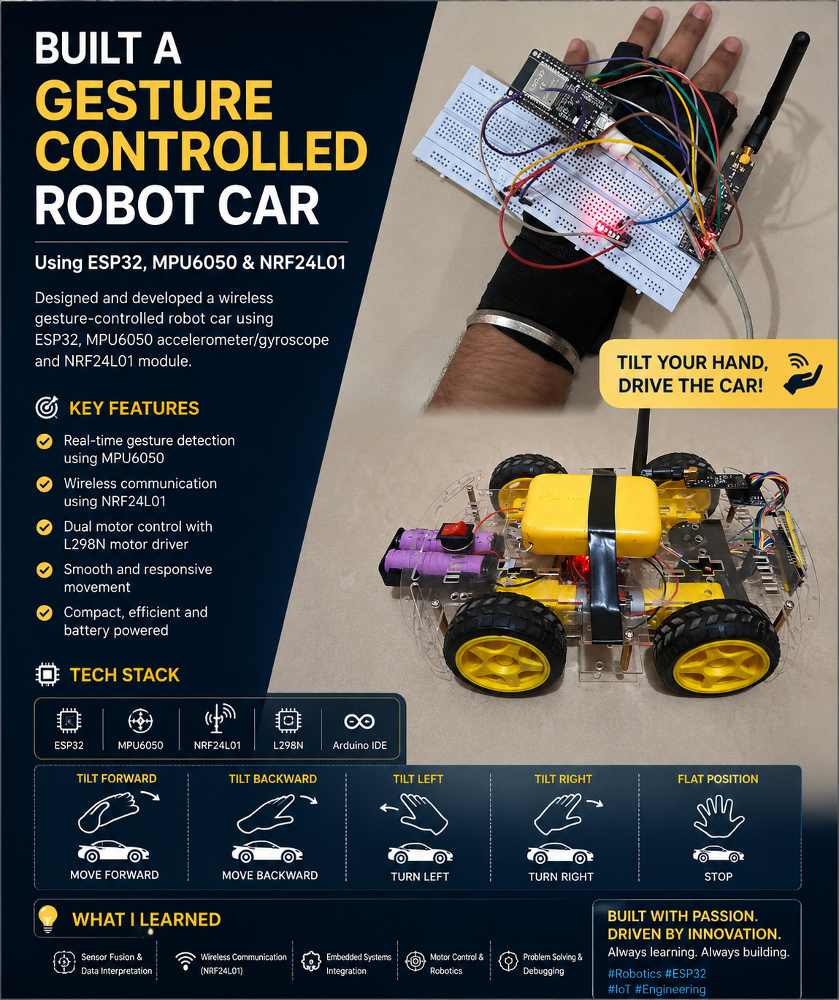

# 🚗 Gesture Controlled Robot Car using ESP32, MPU6050 & NRF24L01
## 🎥 Project Demo
Click below to watch:

➡️ [Working Video](./Working.mp4)
---
---
<p align="center">
  
</p>

<p align="center">
  A wireless hand-gesture-controlled robotic car built using <b>ESP32</b>, <b>MPU6050</b>, <b>NRF24L01</b>, and <b>L298N Motor Driver</b>.
</p>

---

## 📌 Overview

This project is a **Gesture Controlled Robot Car** that can be controlled using real-time **hand movements**.

A wearable transmitter mounted on the hand detects gestures using the **MPU6050 Accelerometer + Gyroscope**, processes them through **ESP32**, and sends commands wirelessly using **NRF24L01**.

The receiver mounted on the robotic car receives these signals and controls 4 motors via the **L298N Motor Driver**.

This creates a smooth **human-machine interaction system** using gestures.

---

# ✨ Features

✅ Real-time gesture recognition  
✅ Wireless communication using NRF24L01  
✅ Forward / Backward / Left / Right / Stop control  
✅ ESP32 based processing  
✅ 4-wheel motor drive  
✅ Battery powered robotic system  
✅ Compact transmitter glove  
✅ Embedded systems + robotics integration

---

# 🧠 Working Principle

### Transmitter Side (Hand Controller)
- MPU6050 reads tilt/gesture data.
- ESP32 processes accelerometer values.
- Direction command generated:
  - Forward
  - Backward
  - Left
  - Right
  - Stop
- NRF24L01 transmits signal wirelessly.

### Receiver Side (Robot Car)
- NRF24L01 receives command.
- ESP32 decodes data.
- L298N motor driver activates motors.
- Robot car moves accordingly.

---

# 🛠 Hardware Components

| Component | Quantity |
|----------|----------|
| ESP32 Dev Module | 2 |
| MPU6050 | 1 |
| NRF24L01 + Adapter | 2 |
| L298N Motor Driver | 1 |
| 4 DC Motors | 4 |
| Robot Chassis | 1 |
| Wheels | 4 |
| Breadboard | 1 |
| Li-ion Battery Pack | 1 |
| Jumper Wires | Multiple |

---

# 📡 Gesture Mapping

| Hand Gesture | Robot Action |
|-------------|-------------|
| Tilt Forward | Move Forward |
| Tilt Backward | Move Backward |
| Tilt Left | Turn Left |
| Tilt Right | Turn Right |
| Flat Position | Stop |

---

# 🔌 Pin Connections

## Transmitter ESP32 (Hand Controller)

### MPU6050
| MPU6050 | ESP32 |
|--------|------|
| VCC | 3.3V |
| GND | GND |
| SDA | GPIO21 |
| SCL | GPIO22 |

### NRF24L01 Adapter
| NRF24 | ESP32 |
|------|------|
| VCC | 5V |
| GND | GND |
| CE | GPIO4 |
| CSN | GPIO5 |
| SCK | GPIO18 |
| MOSI | GPIO23 |
| MISO | GPIO19 |

---

## Receiver ESP32 (Car Side)

### NRF24L01 Adapter
| NRF24 | ESP32 |
|------|------|
| VCC | 5V |
| GND | GND |
| CE | GPIO4 |
| CSN | GPIO5 |
| SCK | GPIO18 |
| MOSI | GPIO23 |
| MISO | GPIO19 |

### L298N Motor Driver
| L298N | ESP32 |
|------|------|
| IN1 | GPIO25 |
| IN2 | GPIO26 |
| IN3 | GPIO27 |
| IN4 | GPIO14 |

---

# 📂 Project Structure

```bash
Gesture_Control_Car/
│── Receiver.C
│── Transmitter.C
│── README.md
│── image.png
```

---

# ⚙️ Software Used

- Arduino IDE
- Embedded C / Arduino C++
- RF24 Library
- MPU6050 Library
- Wire Library
- SPI Communication

---

# 🚀 Installation & Setup

## 1. Clone Repository
```bash
git clone https://github.com/Somil450/Gesture_Control_Car.git
```

## 2. Open Arduino IDE

Upload:
- `Transmitter.C` → Hand Controller ESP32
- `Receiver.C` → Car ESP32

## 3. Install Required Libraries

Install:
```bash
RF24
MPU6050
Wire
SPI
```

## 4. Power On
- Turn on transmitter
- Turn on robot car
- Start controlling with hand gestures

---

# 🧩 Challenges Faced

During development:
- Motor direction mismatch
- NRF24L01 power instability
- MPU6050 detection issues
- Wireless communication tuning
- Motor driver debugging
- Right/Left wheel direction correction

These helped improve debugging and embedded system understanding.

---

# 📚 Learnings

This project strengthened my understanding of:

- Robotics
- Wireless Communication
- Sensor Fusion
- Embedded Programming
- Motor Driver Integration
- Debugging Hardware Systems
- Real-Time Control Systems
- ESP32 Programming

---

# 🔮 Future Improvements

- Obstacle Detection
- Camera Streaming
- Mobile App Control
- Voice Commands
- Path Tracking
- AI Based Navigation
- Autonomous Mode

---

# 📸 Project Preview

## Hand Controller
Gesture-based wireless transmitter built using ESP32 + MPU6050 + NRF24L01.

## Robot Car
Wireless robotic car controlled using hand tilt.

---

# 👨‍💻 Author

### Somil Jain
CSE (AI & Robotics) | VIT Chennai  
Passionate about Robotics, AI, IoT & Embedded Systems

GitHub: https://github.com/Somil450

---

# ⭐ If you liked this project, give it a star!